# CosmosX — Technical Architecture Document
**Role:** Chief Software Architect view
**Scope:** Full platform architecture, chain-agnostic. Stellar (or any other chain) is treated as a *plugin*, not a core dependency — see §14.
**Horizon:** designed to still make sense 5 years and many planets from now.

---

## 0. Architectural Philosophy

Three decisions shape everything below:

1. **Modular monolith first, microservices only where justified.** Splitting every subsystem into a network service on day one buys distributed-systems pain (latency, partial failure, deploy coordination) you don't need yet. Instead, we draw **hard domain boundaries in code** (own folder, own types, own DB schema, communicates only through defined interfaces/events) so that any module can be **extracted into a real service later with no rewrite** — only a change in transport (in-process call → HTTP/gRPC call). *Trade-off:* slightly more discipline required up front (no reaching across boundaries "just this once"); payoff is a codebase that scales organizationally, not just technically.
2. **Everything the player *does* is an event.** Mission attempts, mints, scam-sim decisions, XP gains — all flow through one internal event bus. Progression, Achievements, Analytics, and (later) Multiplayer are all **subscribers**, never callers of each other. This is what lets you add a new consumer (e.g., a future "AI tutor" service) without touching existing code. *Trade-off:* eventual consistency instead of immediate — a badge might appear 200ms after a mission completes, not synchronously. Acceptable for this product.
3. **Content is data, not code.** A mission is a JSON/DB record validated against a schema, not a hand-written React component. Module 1's hand-built components remain valid as **custom mechanic plugins**, but the *default* path for new content is schema → generic renderer. This is the only way 8 planets × 8 modules × 3 beats scales without 200 bespoke files.

---

## 1. System Context (C4 Level 1)

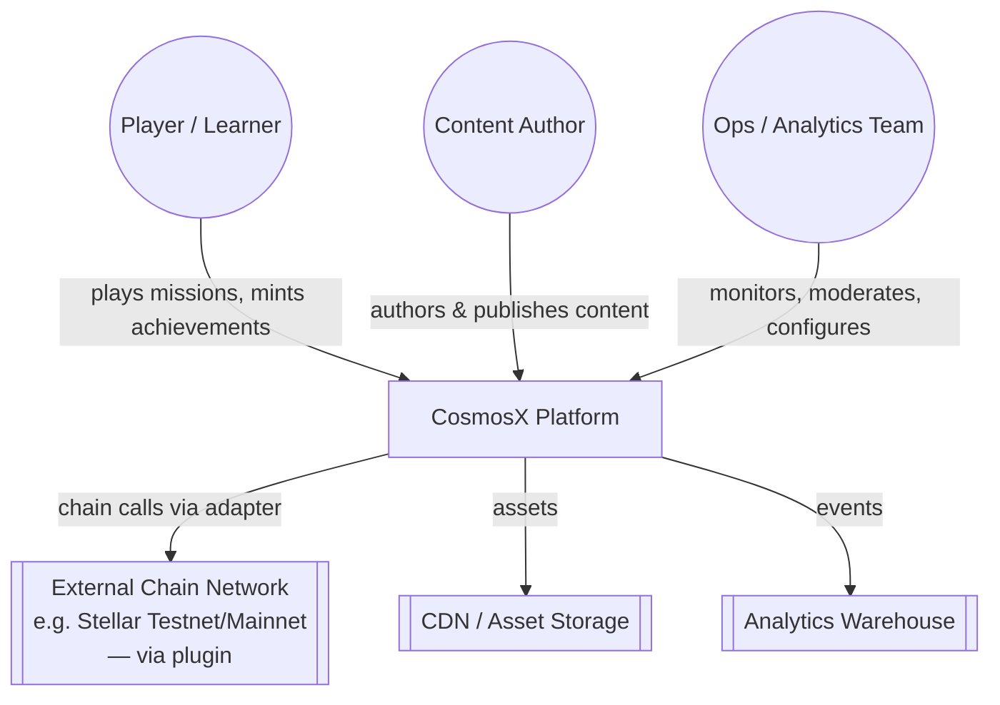

---

## 2. Container Architecture (C4 Level 2)

```mermaid
graph TB
    subgraph Client Layer
        Web[Web App<br/>React 19 + Vite + TanStack Router]
        Studio[Studio App<br/>Mission Builder / CMS]
        AdminUI[Admin Dashboard<br/>Analytics + Moderation]
    end

    subgraph Edge
        GW[API Gateway / BFF<br/>auth, rate limit, request shaping]
    end

    subgraph Core Domain Modules (modular monolith)
        Identity[Identity & Profile]
        Content[Content Service]
        MissionEngine[Mission Engine]
        Progression[Progression Service]
        Achievements[Achievement Service]
        ScamSim[Scam Simulation Engine]
        Analytics[Analytics Service]
        Multiplayer[Multiplayer/Presence]
    end

    subgraph Infra
        Bus[(Internal Event Bus)]
        DB[(Primary DB<br/>Postgres)]
        Cache[(Redis<br/>sessions, presence, cache)]
        ObjStore[(Object Storage<br/>assets, content packages)]
        Warehouse[(Analytics Warehouse<br/>ClickHouse/BigQuery)]
    end

    subgraph Plugins
        ChainPlugin[Chain Adapter Plugin<br/>e.g. Stellar]
        MechanicPlugins[Mechanic Plugins]
    end

    Web --> GW
    Studio --> GW
    AdminUI --> GW

    GW --> Identity
    GW --> Content
    GW --> MissionEngine
    GW --> Progression
    GW --> Achievements
    GW --> ScamSim
    GW --> Multiplayer
    GW --> Analytics

    MissionEngine -- publishes --> Bus
    ScamSim -- publishes --> Bus
    Bus --> Progression
    Bus --> Achievements
    Bus --> Analytics

    Achievements --> ChainPlugin
    MissionEngine --> MechanicPlugins

    Identity --> DB
    Content --> DB
    Content --> ObjStore
    Progression --> DB
    Achievements --> DB
    ScamSim --> DB
    Multiplayer --> Cache
    Analytics --> Warehouse
    MissionEngine --> Cache
```

**Design decision:** the Gateway is a single BFF, not per-client APIs. *Trade-off:* one more hop, but one auth/rate-limit/versioning surface instead of three.

---

## 3. Monorepo & Folder Structure

```
cosmosx/
├── apps/
│   ├── web/                     # Player-facing app (existing React app lives here)
│   │   ├── src/
│   │   │   ├── routes/           # TanStack Router file-based routes
│   │   │   ├── features/         # planet/, mission-player/, wallet/, marketplace/...
│   │   │   └── app-shell/        # nav, layout, theming
│   ├── studio/                   # Mission Builder (see §12)
│   └── admin/                    # Analytics + moderation dashboard
│
├── services/                     # Deployable units (each wraps one domain module)
│   ├── gateway/
│   ├── identity-service/
│   ├── content-service/
│   ├── mission-engine-service/
│   ├── progression-service/
│   ├── achievement-service/
│   ├── scam-sim-service/
│   ├── analytics-service/
│   └── multiplayer-service/
│
├── packages/                     # Shared libraries (no side effects, versioned internally)
│   ├── domain-types/             # Planet, Module, Mission, Player, Achievement... (TS types + Zod schemas)
│   ├── content-schema/           # JSON Schema / Zod validators for content packages
│   ├── mission-engine-core/      # State machine logic, framework-agnostic
│   ├── game-mechanics/           # Reusable interaction primitives (drag-drop, terminal-sim, scrubber...)
│   ├── plugin-sdk/               # Interfaces: ChainAdapter, MechanicPlugin, AnalyticsSink
│   ├── event-contracts/          # Typed event names/payloads for the internal bus
│   ├── ui-kit/                   # Design system (Radix/shadcn wrappers, tokens)
│   └── analytics-sdk/            # Typed client+server event emitter
│
├── plugins/                      # Swappable implementations of plugin-sdk interfaces
│   ├── chain-stellar/
│   ├── chain-mock/                # default no-op adapter for local dev / other chains later
│   ├── mechanic-drag-sort/
│   ├── mechanic-terminal-sim/
│   └── mechanic-node-graph/
│
├── content/                       # Authored curriculum, versioned as data (see §5)
│   ├── planets/mercury/modules/01/beats/01.json
│   └── scam-scenarios/phishing-basic/scenario.json
│
├── infra/
│   ├── terraform/ (or pulumi)     # cloud infra as code
│   ├── k8s/                       # manifests/helm charts per service
│   └── ci/                        # pipeline definitions
│
└── tools/
    ├── content-cli/                # validate/publish content packages
    └── schema-gen/                 # generate TS types from schemas
```

**Module boundary rule:** a package under `services/*` may import from `packages/*` freely, but **never** from another `services/*` directly — only through the Gateway API or the event bus. This is the enforceable rule (via lint/dependency-cruiser) that keeps the "modular" in "modular monolith."

---

## 4. Core Domain Data Model

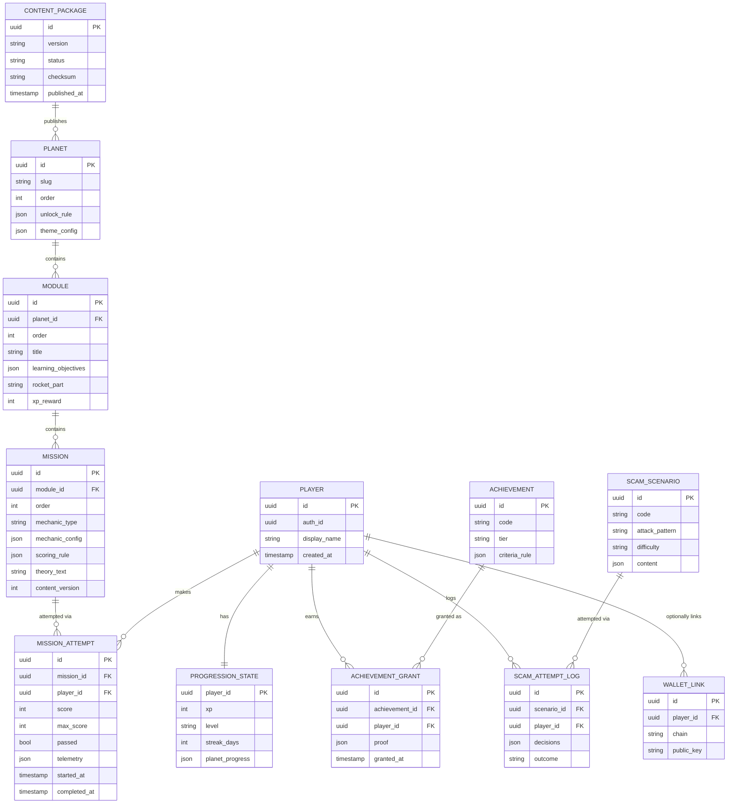

**Key decision:** `ACHIEVEMENT_GRANT.proof` is a **chain-agnostic JSON blob** (`{type: "onchain"|"offchain", chain?, txHash?, contractId?}` or `{type:"offchain", certificateId}`). The achievement system never hard-codes "Stellar" — see §10 and §14.

---

## 5. Learning Engine

**Purpose:** the pedagogical contract — curiosity-before-vocabulary, action-before-explanation, productive failure — expressed as a reusable runtime, not re-implemented per planet.

**Responsibilities:** own the "beat loop" (Briefing → Observe → Interact → Discover → Theory → Replay → Reflect) as a generic state machine that any mission, on any planet, plugs into.

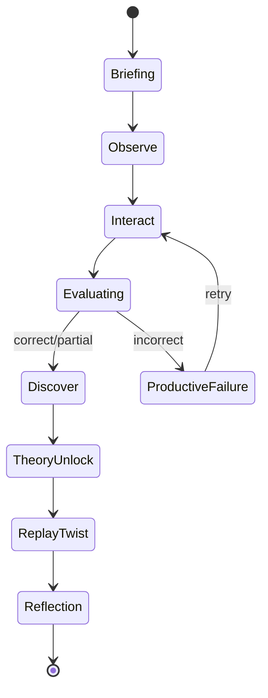

**Extension point:** the `Interact` state delegates entirely to a **Mechanic Plugin** (§6) resolved by `mission.mechanic_type`. New mechanic = new plugin, zero changes to the Learning Engine itself.

**Design decision:** the loop is enforced by a state machine library (e.g., XState) rather than ad hoc component state, specifically so the "non-negotiable teaching rules" from the curriculum (no theory before action, productive failure has a recovery path) are **structurally impossible to violate** by a content author or a rushed engineer — not just a style guideline.

---

## 6. Mission Engine

**Purpose:** executes one Mission record end-to-end: renders the mechanic, scores the answer, emits the attempt event.

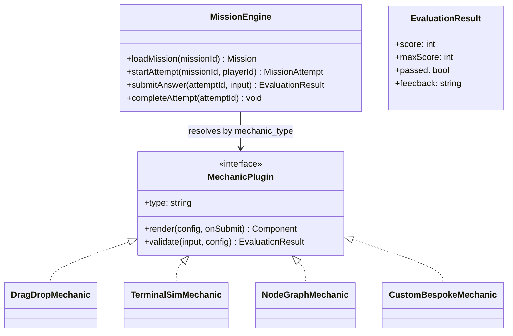

**Design decision — the Module-1 problem, solved architecturally:** Module 1's bespoke components (`Task1_1_MiddlemanMapper`, etc.) are not special-cased legacy — they become **`CustomBespokeMechanic`** implementations of the same `MechanicPlugin` interface as the generic ones. This means "hand-build this one mission because the generic runner can't do it justice" is a **first-class, supported path**, not a workaround — solving the exact Module-2-8 depth gap identified earlier without a rewrite.

**Data flow on submit:**
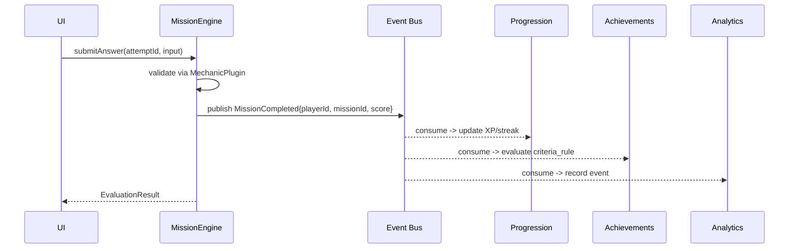

---

## 7. Planet System

**Purpose:** the meta-structure organizing Modules into Planets, and Planets into a campaign graph — unlock rules, ordering, theming.

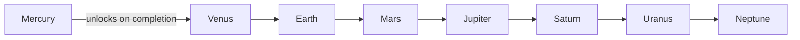

**Data decision:** `unlock_rule` is a small rule-expression (`{"type":"planet_completed","planetId":"mercury"}` or, later, `{"type":"any_of",[...]}`) evaluated by a generic **Unlock Rule Engine**, not hardcoded `if` statements per planet — this is what lets you later add non-linear unlock paths (e.g., "complete any 2 of 3 intro planets") without touching routing code.

**Extension point:** planets are **data records**, not routes hardcoded in `MODULES`/`MODULE_TITLES` arrays as in the current build. A new planet = a new row + a content package, not a new `.tsx` route file (the route becomes a single generic `/planets/[slug]` renderer).

---

## 8. Game Systems (Mechanic Library)

**Purpose:** the reusable interaction primitives — drag-and-drop, card-sort, rewind scrubber, terminal simulator, node/topology graph, comparison engine — decoupled from any specific mission's content.

**Folder:** `packages/game-mechanics/` — one subfolder per mechanic, each exporting a component + a `validate()` function conforming to `MechanicPlugin`.

**Design decision:** mechanic *config* (what's draggable, what the correct answer is) lives in content (§5's Mission record); mechanic *behavior* (how dragging works, how scoring is computed) lives in code. This split is what turns "21 generic beats" into "21 configurations of 6 mechanics" instead of 21 bespoke files — directly targeting the Modules 2-8 gap.

**Extension point:** `plugin-sdk` defines `MechanicPlugin`; a `mechanic-registry` maps `mechanic_type` string → implementation, loaded at boot. Third-party or future teams add mechanics by registering, not by modifying the Mission Engine.

---

## 9. Content Pipeline

**Purpose:** turn curriculum design docs (like the Mercury PDF) into validated, versioned, publishable Mission/Module/Planet records — with a real editorial workflow.

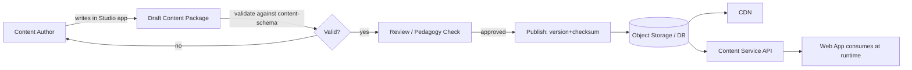

**Versioning decision:** every published Mission carries a `content_version`; a player's `MISSION_ATTEMPT` references the version they actually played. This means you can **improve/rebalance a mission without invalidating historical analytics or already-granted achievements** — critical once you have real users and a 5-year data history.

**Localization extension point:** `mechanic_config`/`theory_text` fields are keyed by locale from day one (`{"en": "...", "hi": "..."}`), even if only `en` is populated now — retrofitting i18n onto flat strings later is expensive; reserving the shape now is nearly free.

---

## 10. Achievement System

**Purpose:** a generic rule engine that grants achievements based on events, and records "proof" in a chain-agnostic way.

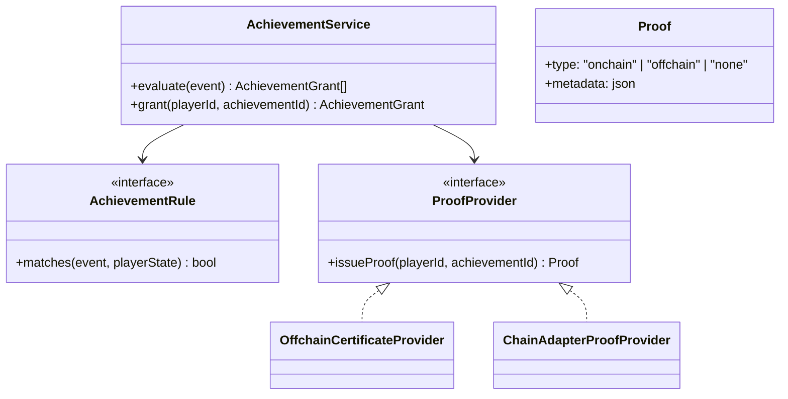

**Design decision:** achievements are granted **regardless of whether a chain adapter is configured**. `OffchainCertificateProvider` (a signed JSON/PDF certificate) is the default; `ChainAdapterProofProvider` (which calls into §14's plugin) is opt-in per achievement type. This means the Learning Engine's core value (badges, certificates, progress) works even in an environment with no chain connectivity at all — chain proof is an enhancement, never a dependency.

---

## 11. Scam Simulation Engine

**Purpose:** the "risk-free scam gym" — phishing pages, fake wallet prompts, rug-pull scenarios — as a first-class, sandboxed subsystem, not a bolt-on.

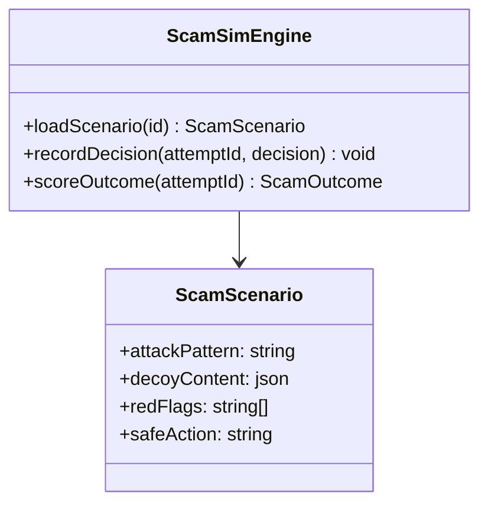

**Safety-by-design decision:** every rendered "malicious" artifact (fake wallet popup, fake mint page) is rendered **inside an explicitly sandboxed component namespace** (`scam-sim/*`) that: (a) cannot make real network calls to any external domain, (b) cannot invoke the real Chain Adapter plugin, (c) is visually watermarked in dev/test builds. This is a deliberate architectural firewall so a "realistic phishing simulation" can never accidentally become a functioning phishing capability if scenario content is ever compromised or mis-authored.

**Extension point:** new attack patterns are added as new `ScamScenario` content records (same content pipeline as §9), not new code — a new "fake airdrop" scenario is authored, not engineered.

**Content-authoring guardrail:** scenario content passes through the same `content-schema` validator as missions, plus an additional **red-flag-coverage check** (every scenario must declare the specific tells a player should learn to notice) — enforced at publish time, not left to author discipline.

---

## 12. Mission Builder (Studio App)

**Purpose:** let non-engineers (or fast-moving engineers) author new missions without writing React.

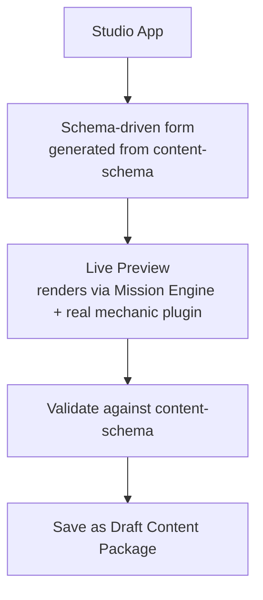

**Design decision:** the Studio app **reuses the exact same Mission Engine + Mechanic Plugins** the player-facing app uses for its live preview — no separate "preview renderer" to maintain in parallel and drift out of sync.

**Extension point:** `content-schema` is the single source of truth for both the form generation and the runtime validation — add a field to the schema, and the authoring form gains it automatically.

---

## 13. Multiplayer Possibilities (Future-Ready, Not Built Now)

**Purpose:** architecture that *permits* co-op/competitive features later without redesigning core services.

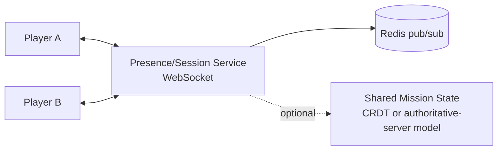

**Design decision (deferred, not built):** keep `MISSION_ATTEMPT` modeled as **one player's attempt**, even for future co-op missions — a co-op mission becomes a `MissionAttempt` with `participant_ids: []` rather than a new entity, so Progression/Achievements/Analytics don't need co-op-aware special cases later.

**Realistic near-term multiplayer, not full co-op:** live leaderboards (already partly built) and "activity feed" (already in `user-store.ts` as mock data) are the cheap, high-value multiplayer-adjacent wins — real-time via the same Presence/Redis pub-sub, no session-sync complexity required.

**Trade-off flagged:** true synchronous co-op missions (two players solving one puzzle together) require an authoritative-state model (server-resolved conflicts) or CRDTs — genuinely complex, and explicitly **out of scope** until there's product evidence players want it.

---

## 14. Plugin System

**Purpose:** the seam that keeps CosmosX's core from ever depending on one blockchain, one mechanic set, or one analytics vendor.

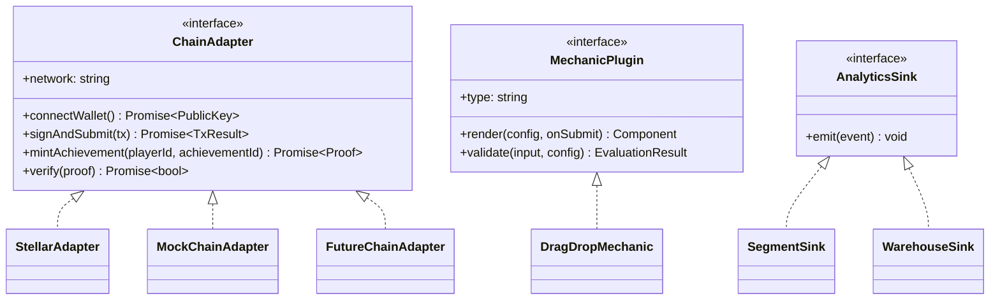

**This is the direct architectural answer to "ignore Stellar for now":** `chain-stellar` is one interchangeable implementation of `ChainAdapter`, registered at boot via config (`CHAIN_ADAPTER=stellar|mock|<future-chain>`). Nothing in Mission Engine, Achievement Service, or the frontend imports `@stellar/*` directly — only `plugins/chain-stellar/` does. Adding a second chain later, or removing Stellar entirely, touches one plugin folder and one config value.

**Design decision:** plugins are **registered, not discovered by magic** — an explicit `plugin-registry.ts` lists active plugins per environment. *Trade-off:* one file to update per new plugin (small friction) in exchange for zero "which plugins are even active in prod" mystery (large operational win).

---

## 15. Backend, APIs & Analytics

### 15.1 Backend service boundaries
Each `services/*-service` owns its own schema/tables — no cross-service joins in SQL, ever. Cross-domain reads go through the Gateway calling both services and composing, or through denormalized read models updated via the event bus (CQRS-lite) where composing at request time would be too slow (e.g., a leaderboard).

### 15.2 API design
- **External-facing:** REST via the Gateway (simple, cacheable, easy for a Mission Builder/Studio client and eventual third-party integrations).
- **Internal:** typed RPC (tRPC or gRPC) between Gateway and services — internal contracts can evolve faster than a public REST surface should.
- **Versioning:** URL-versioned externally (`/v1/...`); internal RPC versioned via the shared `domain-types` package so breaking changes are a compile error, not a runtime surprise.

### 15.3 Analytics
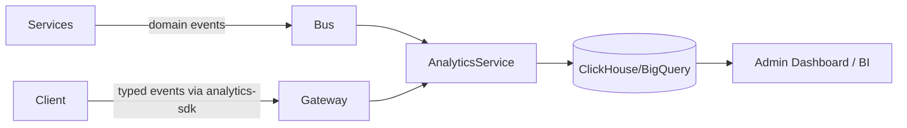
**Design decision:** analytics events are **the same event-contracts package** used for the internal bus, not a parallel ad hoc `track()` call sprinkled through UI code — one schema, two consumers (business logic + analytics), so instrumentation can never silently drift from what actually happened in the domain.

---

## 16. Deployment Architecture

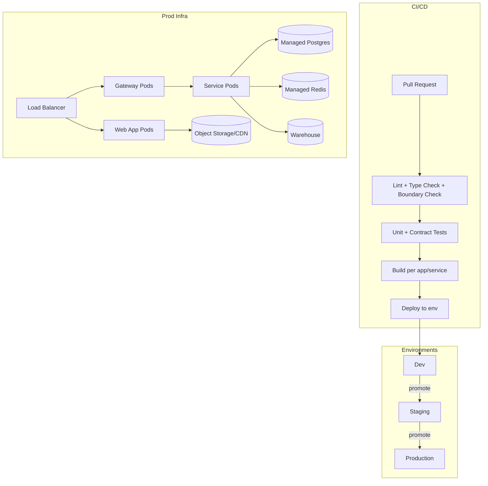

**Design decisions:**
- **Boundary Check in CI is not optional** — a dependency-cruiser (or similar) rule fails the build if `services/*` imports another `services/*` directly, or if any file outside `plugins/chain-*` imports a chain SDK. This is what makes the module-boundary rule in §3 real instead of aspirational.
- **Same container image family for all services** (shared base image, per-service entrypoint) — keeps ops overhead low while the platform is still one team, without blocking a future move to fully independent images per service.
- **Environments promote, never diverge** — the same content-schema validation, same plugin registry shape runs in Dev/Staging/Prod; only config (which `ChainAdapter`, which DB) differs.

---

## 17. Five-Year Extensibility Summary

| If, in year 3, you need to... | ...the architecture already supports it via |
|---|---|
| Add a 9th planet | New Planet + Content Package records — no new route/component code |
| Add a new mechanic type (e.g. AR/VR interaction) | New `MechanicPlugin` implementation + registry entry |
| Support a second blockchain, or drop Stellar | New/removed `ChainAdapter` plugin; zero core changes |
| Add real-time co-op missions | `MISSION_ATTEMPT.participant_ids` + Presence service already modeled for it |
| Let a partner org author their own scam scenarios | Studio app + content-schema validation, sandboxed by design |
| Split Achievement Service onto its own cluster for load reasons | Already a bounded module communicating only via Gateway/event bus — extract, don't rewrite |
| Support a new locale | `theory_text`/`mechanic_config` are already locale-keyed maps |
| Prove product usage to investors/SCF/etc. | Analytics events have been the same typed contracts since day one — no retrofitted instrumentation gap |
